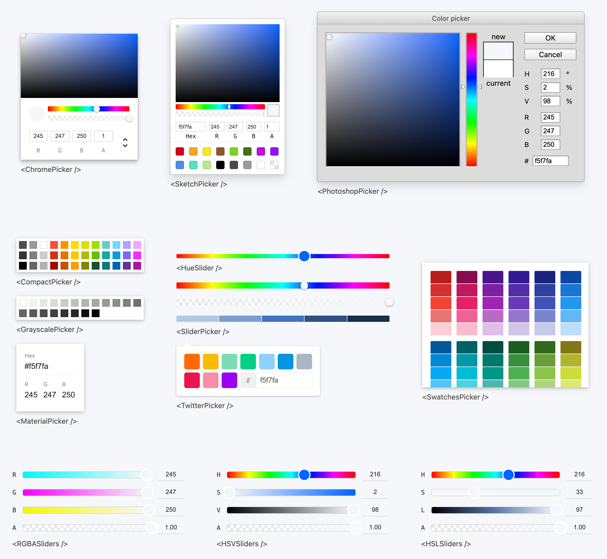

# 🎨 Vue Color v3.0

<p>
  <a href="https://www.npmjs.com/package/vue-color"></a>
  <a href="https://github.com/linx4200/vue-color"></a>
</p>


A collection of efficient and customizable color pickers built with [Vue 3](https://vuejs.org/), designed for modern web development.

## 🧪 Live Demo

Explore the components in action: 👉 [Open Live Demo](https://linx4200.github.io/vue-color/)



## ✨ Features

- **Modular & Tree-Shakable** – Import only what you use

- **TypeScript Ready** – Full typings for better DX

- **SSR-Friendly** – Compatible with Nuxt and other SSR frameworks

- **Optimized for Accessibility** – Built with keyboard navigation and screen readers in mind.

## 📦 Installation

```bash
npm install vue-color
# or
yarn add vue-color
```

## 🚀 Quick Start

### 1. Import styles

```ts
// main.ts
import { createApp } from 'vue'
import App from './App.vue'

// Import styles
import 'vue-color/style.css';

createApp(App).mount('#app')
```

### 2. Use a color picker component

```vue
<template>
  <ChromePicker v-model="color" />
</template>

<script setup lang="ts">
import { ChromePicker } from 'vue-color'

const color = defineModel({
  default: '#68CCCA'
});
</script>
```

> 📘 For a full list of available components, see the [Documentation](#all-available-pickers).

## 📚 Documentation

### All Available Pickers

All color pickers listed below can be imported as named exports from `vue-color`.

```ts
import { ChromePicker, CompactPicker, HueSlider /** ...etc  */ } from 'vue-color';
```

| Component Name | Docs |
| ------- | ------- |
|  ChromePicker  |  [View](./docs/components/ChromePicker.md)  |
|  CompactPicker   | [View](./docs/components/CompactPicker.md)   |
|  GrayscalePicker   | [View](./docs/components/GrayscalePicker.md)   |
|  MaterialPicker   |  -  |
|  PhotoshopPicker   | [View](./docs/components/PhotoshopPicker.md)   |
|  SketchPicker   |  [View](./docs/components/SketchPicker.md)  |
|  SliderPicker   | [View](./docs/components/SliderPicker.md)   |
|  SwatchesPicker   | [View](./docs/components/SwatchesPicker.md)   |
|  TwitterPicker   |  [View](./docs/components/TwitterPicker.md)  |
|  HueSlider   |  [View](./docs/components/HueSlider.md)  |
|  AlphaSlider   |  -  |

### Props & Events

All color picker components (expect for `<HueSlider />`) in `vue-color` share a set of common props and events for handling color updates and synchronization.
Below we'll take `<ChromePicker />` as an example to illustrate how to work with `v-model`.

#### `v-model`

```vue
<template>
  <ChromePicker v-model="color" />
</template>

<script setup>
import { ChromePicker } from 'vue-color'

const color = defineModel({
  default: 'rgb(50, 168, 82)'
});
</script>
```

The `v-model` of `vue-color` accepts a variety of color formats as input. **It will preserve the format you provide**, which is especially useful if you need format consistency throughout your app.

```ts
const color = defineModel({
  default: 'hsl(136, 54%, 43%)'
  // or
  default: '#32a852'
  // or
  default: '#32a852ff'
  // or
  default: { r: 255, g: 255, b: 255, a: 1 }
});
```

Under the hood, `vue-color` uses [`tinycolor2`](https://www.npmjs.com/package/tinycolor2) to handle color parsing and conversion.
This means you can pass in any color format that `tinycolor2` supports—and it will just work.

#### `v-model:tinyColor`

```vue
<template>
  <ChromePicker v-model:tinyColor="tinyColor" />
</template>

<script setup>
import { ChromePicker, tinycolor } from 'vue-color';

const tinyColor = defineModel('tinyColor', {
  default: tinycolor('#F5F7FA')
});
</script>
```

In addition to plain color values, you can also bind a `tinycolor2` instance using `v-model:tinyColor`.
This gives you full control and utility of the `tinycolor` API.

> ⚠️ Note: You must use the `tinycolor` exported from `vue-color` to ensure compatibility with the library's internal handling.

### SSR Compatibility

Since `vue-color` relies on DOM interaction, components must be rendered client-side. Example for Nuxt:

```vue
<template>
  <ClientOnly>
    <ChromePicker />
  </ClientOnly>
</template>

<script setup lang="ts">
import { ClientOnly } from '#components';
import {ChromePicker } from 'vue-color';
</script>
```

## 🧩 FAQ / Issue Guide

| Error / Symptom | Related Issue |
|--------|----------------|
| `TS2742: The inferred type of 'default' cannot be named without a reference to ...` (commonly triggered when using `pnpm`) | [#278](https://github.com/linx4200/vue-color/issues/278) |

## 🤝 Contributing

Contributions are welcome! Please open issues or pull requests as needed.

## 📄 License

[MIT](./LICENSE)
